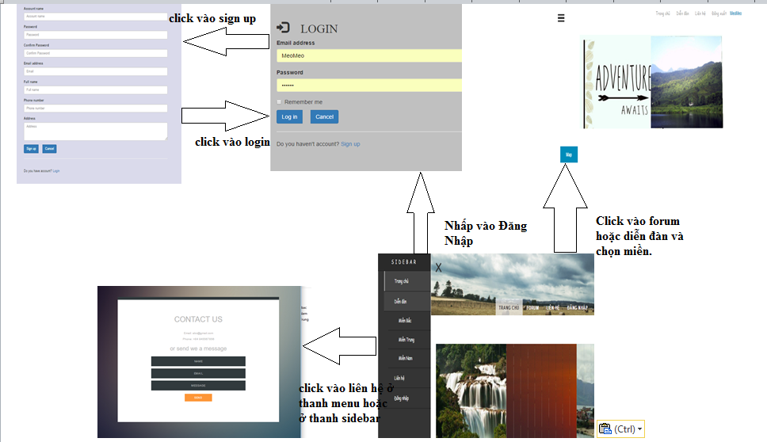
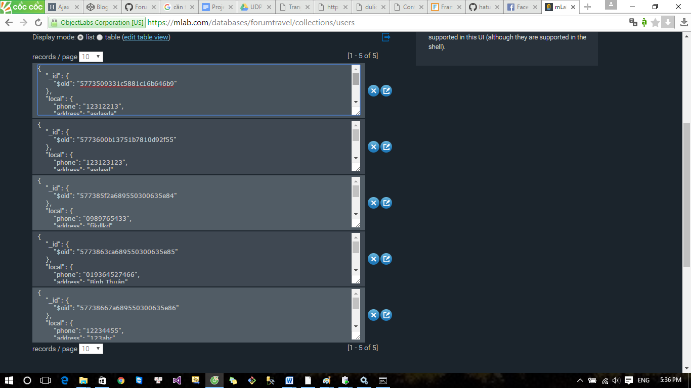
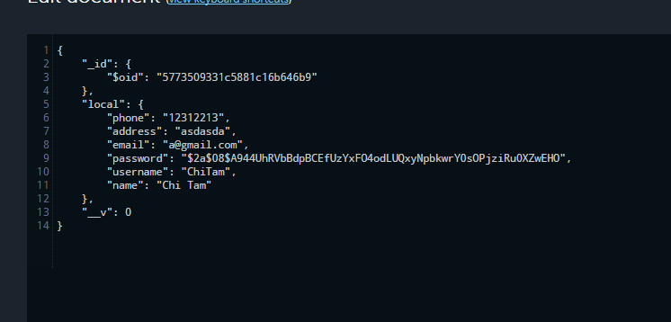

# Đồ án - *TravelForum*

**TravelForum** là đồ án môn UDPT.

Thành viên: 
	**Nguyễn Chí Tâm - 1312507
        Thông Thị Thanh Hằng - 1312178
	Phan Huỳnh Diệp Trúc - 1112508**

URL: https://dulich.herokuapp.com

## Mô tả

* Website nhằm mục đích chia sẻ kinh nghiệm khi đi du lịch tự túc và giới thiệu các địa điểm du lịch trên đất nước VN, bên cạnh đó, thành viên có thể chia sẻ kinh nghiệm, tìm kiếm bạn đồng hành cho những chặng đường mới

## Chức năng

Danh sách chức năng **bắt buộc**:

* [x] Đăng ký tài khoản bằng accout name, password, tên, email, số điện thoại và địa chỉ.
* [x] Đăng nhập bằng user và password hoặc đăng nhập bằng tài khoản FaceBook.
* [x] Đăng xuất tài khoản.
  
Danh sách chức năng **phụ**:
<h3> Nội dung: </h3>
<h4>1. WireFrame</h4>
*Mô tả hướng xử lý luồng giữa các màn hình.*

<h4>2. Data schema.</h4>
- Data lưu trữ tại mLab.com.
- Dữ liệu người dùng:

- Dữ liệu chi tiết:

- Dữ liệu gồm các thuộc tính:
 + email: email của người dùng, dùng trong các trường hợp thông báo, thông tin khi có sự cố xảy ra.
 + password đã được mã hóa.
 + phone: số điện thoại của
 + address: địa chỉ
 + username: tài khoản mà người dùng đăng ký.
 + name:Họ tên của người dùng.
 <h4>3. Demo (gif).</h4>

<h4>4. Chuẩn đầu ra.</h4>
Chuẩn đầu ra | Đã đạt | Mô tả
-------------|--------|----------
G1.2 | Đạt |Sử dụng Git theo Feature Branch Workflow
G3.1 | Đạt|Giải thích được các xử lý
G5.1| Đạt|Thiết kế responsive
G5.2| Đạt| Lập trình JS với animation Sử dụng MVC và module
G5.3 & G5.5|Đạt | Sử dụng decorators để tách một số xử lý liên quan giao diện khỏi model
G5.4| Không đạt|
G6.1 & G6.2|Không đạt |
G7.1|Không đạt |
G8.1| Không đạt |
G8.3|Đạt | CSS framework: bootstrap, foundation,...

## License

    Copyright [yyyy] [name of copyright owner]

    Licensed under the Apache License, Version 2.0 (the "License");
    you may not use this file except in compliance with the License.
    You may obtain a copy of the License at

        http://www.apache.org/licenses/LICENSE-2.0

    Unless required by applicable law or agreed to in writing, software
    distributed under the License is distributed on an "AS IS" BASIS,
    WITHOUT WARRANTIES OR CONDITIONS OF ANY KIND, either express or implied.
    See the License for the specific language governing permissions and
    limitations under the License.
